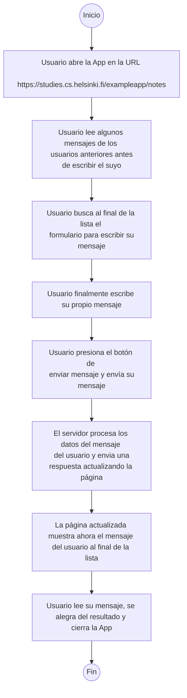

# User create new note in App

```mermaid

flowchart TD
A((Inicio))--> 
B[Usuario abre la App en la URL \n https://studies.cs.helsinki.fi/exampleapp/notes] -->
C[Usuario lee algunos mensajes de los \n usuarios anteriores antes de escribir el suyo]-->
D[Usuario busca al final de la lista el \n formulario para escribir su mensaje] -->
E[Usuario finalmente escribe su propio mensaje] -->
F[Usuario presiona el botón de \n enviar mensaje y envía su mensaje]-->
G[El servidor procesa los datos del mensaje \n del usuario y envia una respuesta actualizando la página]-->
H[La página actualizada muestra ahora el mensaje del usuario al final de la lista]-->
I[Usuario lee su mensaje, se alegra del resultado y cierra la App]-->
J((Fin))

```
