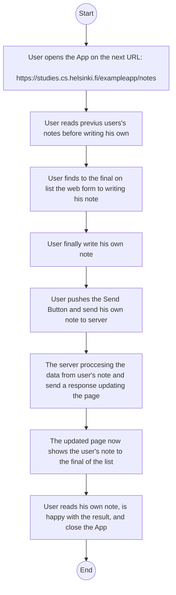

# User create new note in App flow

## Excercise 0.4

The next block it a Mermaid code for generate a simply diagram:

```mermaid

flowchart TD
A((Start))-->
B[User opens the App on the next URL: \n https://studies.cs.helsinki.fi/exampleapp/notes] -->
C[User reads previus users's notes before writing his own]-->
D[User finds to the final on list the web form to writing his note] -->
E[User finally write his own note] -->
F[User pushes the Send Button and send his own note to server]-->
G[The server proccesing the data from user's note and send a response updating the page]-->
H[The updated page now shows the user's note to the final of the list]-->
I[User reads his own note, is happy with the result, and close the App]-->
J((End))

```
